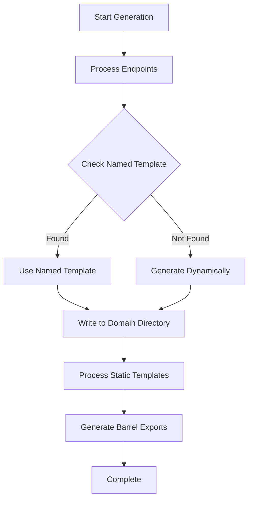

# 03 - Template System Architecture

## Overview

The frontend generator uses a sophisticated three-tier template system to generate frontend code from backend configurations. This system provides flexibility for endpoint-specific overrides, reusable patterns, and static file copying.

## Template Directory Structure

```
tools/frontend-tools/frontend-generator-v2/templates/
├── named/              # Endpoint-specific template overrides
│   ├── hooks/
│   │   └── auth.ts.template
│   ├── services/
│   ├── types/
│   └── pages/
├── dynamic/            # Reusable pattern templates with placeholders
│   └── pages/
│       ├── list_page.tsx.template
│       └── mobile_page.tsx.template
└── static/            # Complete project structure to copy as-is
    ├── components/
    │   ├── action-sheet/
    │   ├── auth/
    │   ├── chess/
    │   └── ...
    ├── hooks/
    │   ├── audio/
    │   ├── chess/
    │   ├── core/
    │   └── ...
    ├── services/
    │   ├── api/
    │   ├── audio/
    │   ├── chess/
    │   └── ...
    ├── types/
    ├── pages/
    ├── utils/
    ├── stores/
    └── constants/
```

## Template System Types

### 1. Named Templates (`templates/named/`)

**Purpose**: Override specific endpoints with custom implementations

**Structure**: 
- `templates/named/{category}/{endpoint_name}.{ext}.template`
- Example: `templates/named/hooks/auth.ts.template`

**Usage**: 
- When generating an endpoint (e.g., "auth"), generators first check for named templates
- If found, uses the named template instead of dynamic generation
- Perfect for complex endpoints that need custom logic

**Output Mapping**:
```
templates/named/hooks/auth.ts.template → src/hooks/authentication/useAuth.ts
templates/named/services/auth.ts.template → src/services/authentication/authService.ts
```

### 2. Dynamic Templates (`templates/dynamic/`)

**Purpose**: Reusable pattern templates with placeholder substitution

**Structure**:
- `templates/dynamic/{category}/{template_name}.template`
- Example: `templates/dynamic/pages/list_page.tsx.template`

**Usage**:
- Contains placeholder variables like `{entity_name}`, `{endpoint_name}`
- Used by generators when no named template exists
- Generates consistent patterns across multiple endpoints

**Placeholders**:
- `{entity_name}` - Capitalized entity (e.g., "User")
- `{endpoint_name}` - Lowercase endpoint (e.g., "users") 
- `{domain}` - Domain category (e.g., "user-management")

### 3. Static Templates (`templates/static/`)

**Purpose**: Copy complete file structures preserving directory hierarchy

**Structure**:
- Mirrors the final output project structure exactly
- `templates/static/{category}/{path}` → `src/{category}/{path}`

**Usage**:
- Complete, ready-to-use files
- No placeholder substitution
- Preserves exact directory structure

**Output Mapping**:
```
templates/static/hooks/chess/useChessGame.ts.template → src/hooks/chess/useChessGame.ts
templates/static/services/audio/audioService.ts.template → src/services/audio/audioService.ts
templates/static/components/auth/AuthLayout.tsx.template → src/components/auth/AuthLayout.tsx
```

## Generator Behavior Patterns

### Endpoint-Based Generators (Hooks, Services, Types, Pages)

**Processing Order**:
1. **Check Named Template**: Look for `templates/named/{category}/{endpoint_name}.template`
2. **Use Named If Found**: Process named template and write to domain-specific output
3. **Fallback to Dynamic**: Generate using backend config + dynamic templates or hardcoded patterns

**Example Flow for `users` endpoint**:
```python
# 1. Check named template
named_template = templates/named/hooks/users.ts.template
if named_template.exists():
    # Use named template
    output: src/hooks/user-management/useUsers.ts
else:
    # Generate dynamically from config
    generate_from_config() → src/hooks/user-management/useUser.ts
```

### Static Generators (Components)

**Processing**:
1. **Process Static Templates**: Copy `templates/static/components/` → `src/components/`
2. **Preserve Structure**: Maintain exact directory hierarchy
3. **Generate Barrels**: Create index.ts files for each directory

## Code Implementation Patterns

### Standard Generator Pattern

All endpoint-based generators follow this pattern:

```python
def generate(self, endpoint_name: str, endpoint_config: dict, domain: str = 'other'):
    # 1. Check for named template first
    named_template = self.template_dir / "named" / "hooks" / f"{endpoint_name}.ts.template"
    if named_template.exists():
        print(f"📝 Using named template: {endpoint_name}.ts.template")
        self._generate_from_named_template(endpoint_name, endpoint_config, domain, named_template)
    else:
        # 2. Generate from config using dynamic approach
        entity_name = endpoint_config.get('entity', endpoint_name.capitalize())
        # ... dynamic generation logic
        self.write_file(output_file, generated_content)

def _generate_from_named_template(self, endpoint_name: str, endpoint_config: dict, domain: str, template_path: Path):
    with open(template_path, 'r', encoding='utf-8') as f:
        template_content = f.read()
    
    output_dir = self.output_path / "hooks" / domain
    output_file = output_dir / f"use{entity_name}.ts"
    
    self.write_file(output_file, template_content)
```

### Static Template Processing

```python
def generate_static_files(self):
    template_base = Path(__file__).parent.parent / "templates"
    
    # Process static template directories
    static_dirs = ['types', 'hooks', 'pages', 'data', 'utils']
    
    for static_dir in static_dirs:
        template_dir = template_base / "static" / static_dir
        if template_dir.exists():
            # Process all template files recursively
            for template_file in template_dir.rglob("*.template"):
                # Calculate relative path from template directory
                rel_path = template_file.relative_to(template_dir)
                
                # Remove .template extension
                output_rel_path = rel_path.with_suffix('')
                
                # Create output file path (NO static/ in the path)
                output_file = self.output_path / static_dir / output_rel_path
```

## File Extension Conventions

- **Template Files**: Always end with `.template`
- **Output Files**: Template extension is removed
  - `component.tsx.template` → `component.tsx`
  - `service.ts.template` → `service.ts`

## Domain Organization

Generated files are organized by domain:

```
src/
├── hooks/
│   ├── authentication/     # auth, user_sessions
│   ├── user-management/    # users, user_profiles, achievements
│   ├── puzzles/           # puzzles, puzzle_attempts
│   └── ...
├── services/
│   ├── authentication/
│   ├── user-management/
│   └── ...
└── types/
    ├── authentication/
    ├── user-management/
    └── ...
```

## Template System Benefits

1. **Flexibility**: Named templates for complex endpoints, dynamic for simple ones
2. **Consistency**: Dynamic templates ensure consistent patterns
3. **Maintainability**: Static templates for complex, reusable components
4. **Override Capability**: Named templates can override any endpoint
5. **Scalability**: Easy to add new templates for new patterns

## Common Use Cases

### When to Use Named Templates
- Complex endpoints with custom logic (e.g., authentication)
- Endpoints requiring special handling
- Override default generation patterns

### When to Use Dynamic Templates
- Standard CRUD operations
- Consistent patterns across multiple endpoints
- Simple, repetitive structures

### When to Use Static Templates
- Complex components with no variation
- Utility functions and configurations
- Complete, ready-to-use implementations

## Template Processing Flow



This three-tier system provides maximum flexibility while maintaining consistency and reducing code duplication across the generated frontend application.